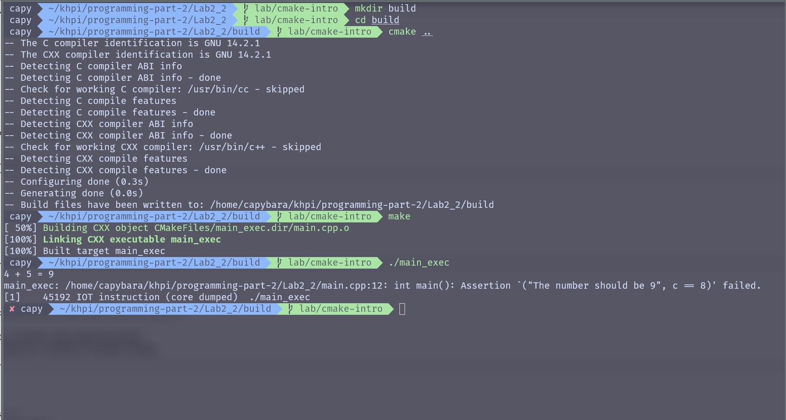

# Programming Part 2

## Laboratory Work #2

### Topic: cmake intro

#### Was done

1. Created laboratory work directory
2. Done base project structure with
   2.1 main.cpp, CMakeLists.txt
   2.2 lib with its own CMakeLists.
3. Connected core and lib, built and test
4. Pushed main task to the origin
5. Added compiler warnings using `target_compile_options`
6. Write basic success and failed unit tests for main.cpp
7. Converted the `math_utils` lib to a header-only implementation

#### Build result

> 

### Tools

- OS: `Arch Linux`
- Text Editor: `nvim`
- Terminal: `zsh`
